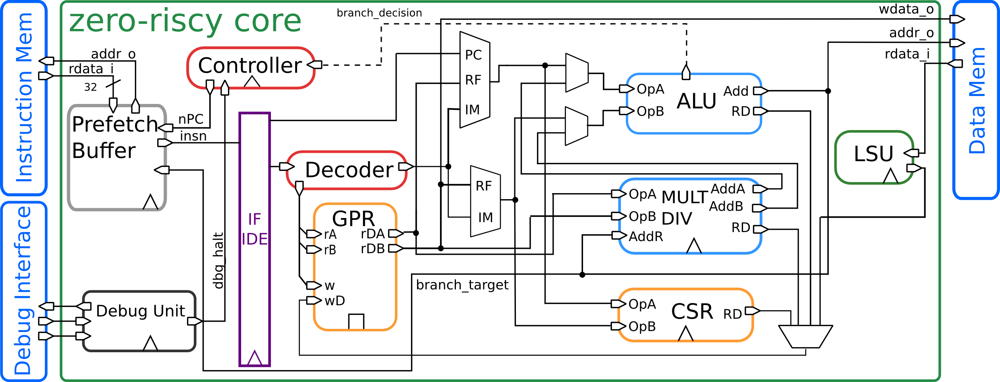

# 已适配的 SoC 的介绍  

## YADAN Core 内核的 YADAN SoC  
### YADAN 项目的简介  
YADAN 项目包含 YADAN Core、YADAN SoC、YADAN Board，分别是 RISC-V 指令集的 CPU 内核、SoC、开发板。  
YADAN SoC 是 VeriMake 设计的一款 SoC，它搭载一颗 RISC-V 指令集的 YADAN Core，开发者可灵活配置自定义的外设。  
  
// TODO: 文档将在近期发布  
  
## Zero-riscy 内核的 PULPino SoC  
### PULPino 与 Zero-riscy 的简介  
  
[The Parallel Ultra Low Power (PULP) Platform](https://pulp-platform.org/) 是由 ETH Zürich (瑞士苏黎世联邦理工学院) 的 Integrated Systems Laboratory (IIS) 和 University of Bologna (意大利博洛尼亚大学) 的 Energy-efficient Embedded Systems (EEES) 在 2013 年开始共同创造的一个定制化 SoC 设计平台，旨在探索用于超低功耗处理的新型高效架构。[PULPino](https://github.com/pulp-platform/pulpino/) 是 PULP Platform 中的一款开源单核 MCU 开发平台，可配置内核为两款 32 位 RISC-V CPU 之一，分别是 RI5CY 和 Zero-riscy。  
  
我们选用 Zero-riscy 内核构建 PULPino SoC 进行后续的实验，[Zero-riscy](https://github.com/lowRISC/ibex/) 是一款二级流水线、按序单发射的处理器，支持标准的 RV32I 指令子集，同时可以配置压缩指令子集（RV32C）、乘除法指令子集（RV32M），还可以被配置成16个通用寄存器版本的 RV32E。Zero-riscy 没有 iCache 和 dCache，核心使用非常简单的数据和指令接口来与数据和指令存储器通信。该内核主要适用于超低功耗、超小面积的场景，结构如图 2.2.1 所示。  

**
  
图 2.2.1 Zero-riscy 内核结构
**
  

// TODO:  
  