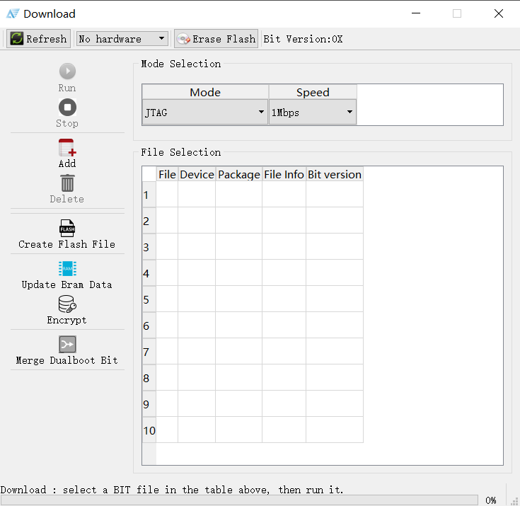

# 使用 YADAN Board  
  
本章将介绍如何把 YADAN SoC 或 PULPino SoC 部署到我们的 YADAN Board 中，使其变成一块类似 Arduino UNO 的嵌入式开发板。部署完成后，配合第三章中在 Arduino IDE 中配置好的环境，我们即可像使用 Arduino 一样便捷地在 YADAN Board 上开发嵌入式软件。  
  
## 部署 SoC 至 FPGA  

综合好的 YADAN SoC 的 `.bit` 文件为 `Yadan.bit`，PULPino SoC 的为 `pulpino_zeroriscy.bit`，分别可在下边两个链接中找到。  
  
+ YADAN SoC: [https://gitee.com/verimake/yadansoc/tree/master/prj](https://gitee.com/verimake/yadansoc/tree/master/prj)
+ PULPino SoC: [https://pan.baidu.com/s/1uzZ-Ic4XPclwRXgk5f-Z_g](https://pan.baidu.com/s/1uzZ-Ic4XPclwRXgk5f-Z_g) (提取码: 3005, 在 “Zeroriscy内核开发工具” 文件夹中)
  
打开安装好的 TD 软件，点击如图 4.1 所示的按钮打开下载工具。
  
**
  
图 4.1 TD 软件中打开下载工具的按钮
** 
  
打开的下载工具的界面如图 4.2。  
**
  
图 4.2 下载工具的界面
** 
  
将 YADAN Board 通过 Type-C USB 线与 PC 机相连，下载工具中原先显示 `No hardware` 的下拉框就会自动更新为 `EG4S20NG88`（如果加载不了需要检查下载器驱动是否正确安装，详情见第 3.3 节）。加载成功开发板后，界面如图 4.3 所示。  
  
**
  
图 4.3 下载工具加载成功开发板后的界面
** 
  
然后点击如图 4 所示的 `Add` 按钮，添加你想部署的 SoC 的 `.bit` 文件。
  
**
  
图 4.4 下载工具中的 `Add` 按钮
**
  
添加 `.bit` 文件完成后，可以看到文件的相关信息，包含该文件适用的芯片型号、封装、生成时间等，如图 4.5 为例。  
  
**
  
图 4.5 显示的 `Yadan.bit` 的文件信息（如果用 PULPino，也能看到类似的内容）
**

`Mode Selection` 中可以选择下载模式，默认的下载模式为 JTAG 模式，适用于调试，但配置会在掉电后丢失。如果我们希望下次上电后 FPGA 能自动加载配置，则需要把配置下载到 FPGA 的配置芯片外置的 Flash 中，即我们需要选择下载模式为 PROGRAM FLASH 模式。下载速度默认为 1Mbps，我们可根据电脑和线材条件自由选择，但如果下载失败，需尝试降低下载速度再重新下载。选择下载模式的下拉框如图 4.6 所示。

**
  
图 4.6 选择下载模式的下拉框
**
  
在该模式下载完成后，开发板每次上电时，会先将 Flash 中的配置数据自动加载到 FPGA 中。  
  
## 使用Arduino IDE开发应用  
  
// TODO:  
  