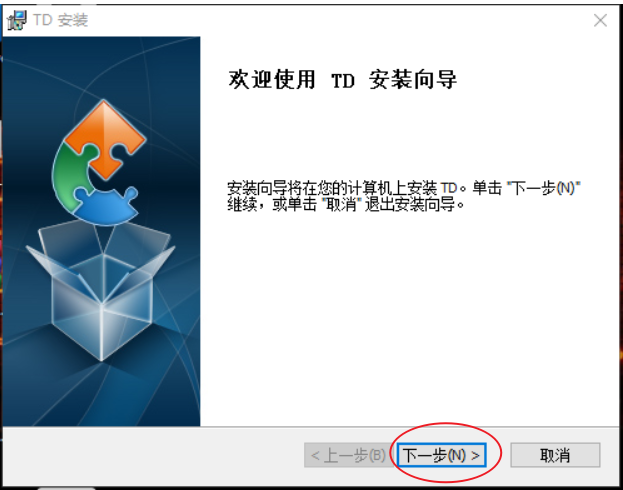
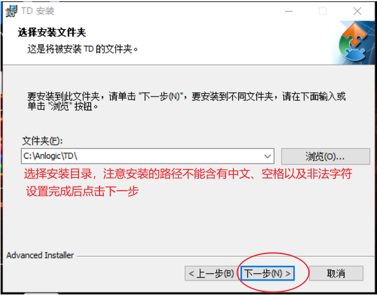
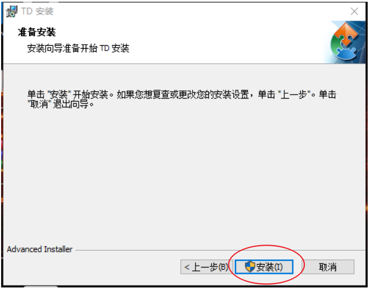
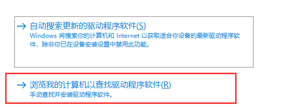
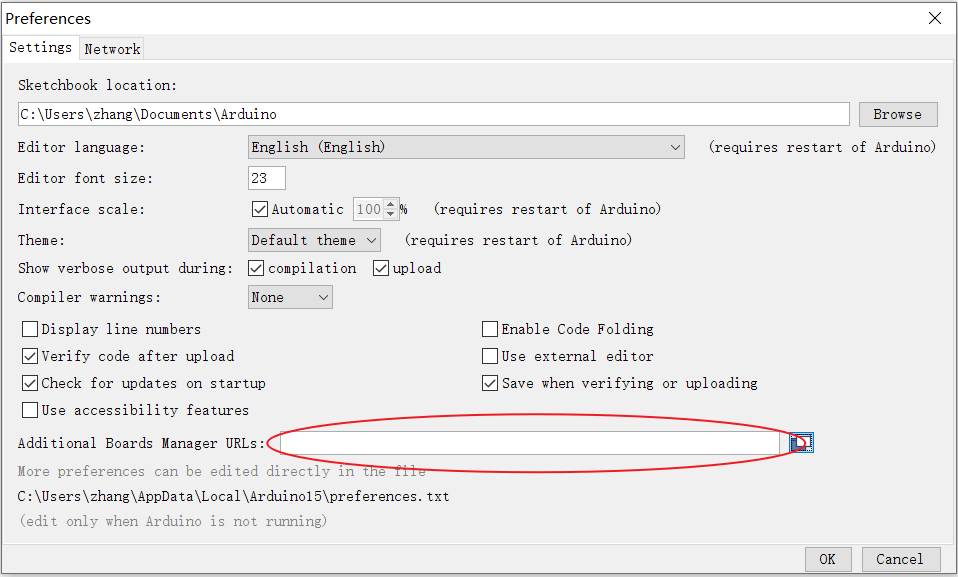
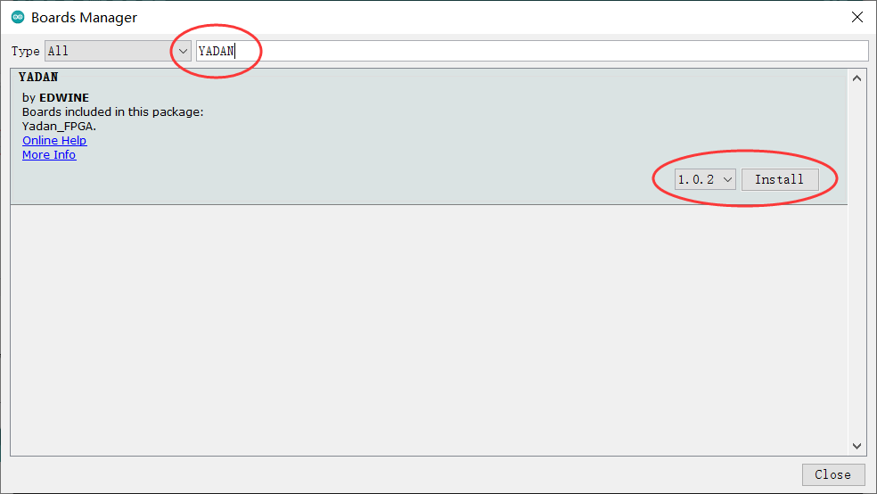
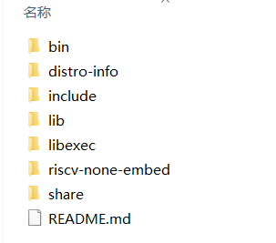
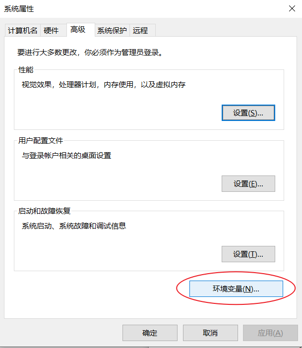
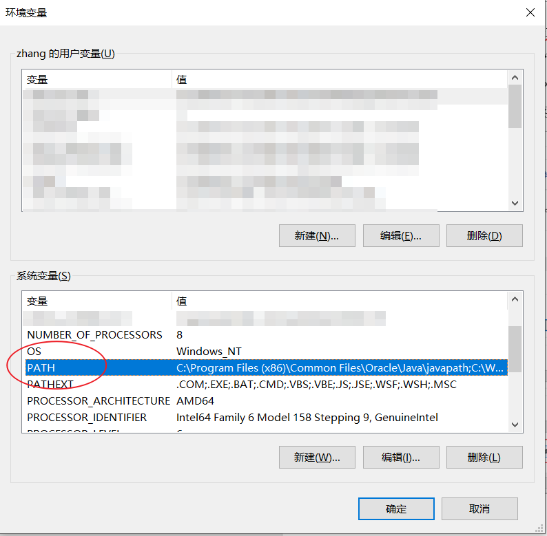
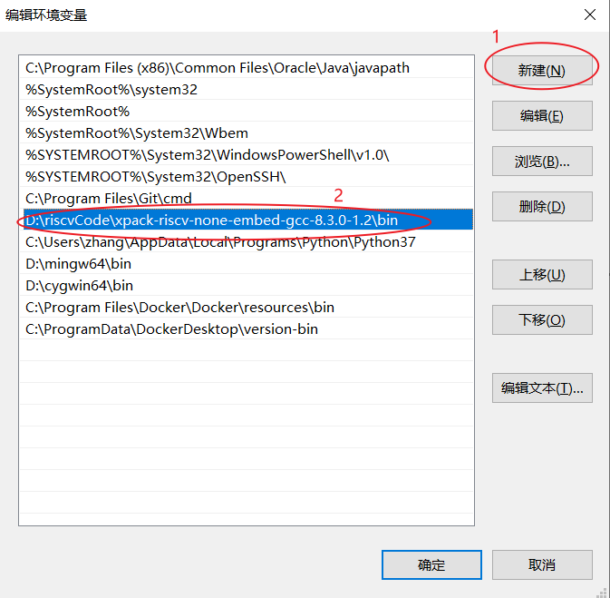

# 搭建开发环境  
接下来我们将正式开始使用 YADAN Board，我们需要安装 TangDynasty 软件、Arduino IDE、RISC-V GCC 工具链等开发工具，本章将会逐步介绍这些软件的安装和配置方法。  
  
软件工具可在其各自的官网下载，也可以在下边这个百度网盘链接中下载。该链接不仅包含本实验所需的软件工具，还包含了一些示例源码。  
  
```
https://pan.baidu.com/s/1uzZ-Ic4XPclwRXgk5f-Z_g?pwd=3005  提取码：3005
```
  
## TangDynasty 软件简介  
TangDynasty® (简称 TD) 软件是安路科技自主开发的 FPGA 集成开发环境，支持工业界标准的设计输入，包含完整的电路优化流程以及丰富的分析与调试工具，并提供良好的第三方设计验证工具接口，为所有基于安路科技 FPGA 产品的应用设计提供有力支持。TD 软件的研发一直秉持着内外兼修的理念，内部核心算法引擎坚持自主研发，为安路 FPGA 结构量身打造；外部交互界面则以简洁可靠，操作便捷为基本设计原则，力争为所有用户提供最好的亲和度。  
  
上海安路信息科技股份有限公司成立于 2011 年，总部位于浦东新区张江科学城。安路科技专注于 FPGA 芯片设计领域，通过多年的技术积累，公司在 FPGA 芯片设计技术、SoC 系统集成技术、FPGA 专用 EDA 软件技术、FPGA 芯片测试技术和 FPGA 应用解决方案等领域均有技术突破。  
  
## 安装 TangDynasty 软件
目前 TD 软件支持 Windows 和 Linux 系统，本节将以 Windows 下的安装方法为例来展示安装步骤。  
  
TD 软件可在 [安路科技官网的这个页面](http://www.anlogic.com/down1.aspx?TypeId=13) 下载，经测试，本教程中后续的步骤可在 5.0.3 或 4.6.6 版本下正常实现，推荐选择 5.0.3 版本。其他版本也可以自行尝试，但步骤与本教程不一定完全相同。  
  
下载完成安装包后，双击安装包，将会进入安装向导。如图 3.1，根据安装向导的提示进行操作即可。  
  
**<center>  
  
  
图 3.1 TD 软件安装向导的操作示意图</center>**
  
安装完成后，可在开始菜单或桌面找到 TD 软件的快捷方式（如果在安装过程中勾选了创建快捷方式），如图 3.2，点击即可启动 TD 软件。  
  
**<center>  
图 3.2 TD 软件的图标</center>**
  
另外要注意的是，如果许可证文件存在错误，软件可能无法正常使用且会弹出提示，请将有效的 `.lic` 文件拷贝到 TD 软件安装路径下的 `license` 目录中，然后重新启动 TD 软件，即可正常使用。许可证文件可在 [附录：下载相关附件](http://docs.yadanboard.com/zh_CN/latest/chap8.html) 中下载。  
  
## 安装开发板的驱动程序
安装完成 TD 软件后，使用 USB Type-C 线将 YADAN Board 连接至电脑上，鼠标右键 `此电脑`，点击 `属性`，再找到并点击 `设备管理器`。在设备管理器中会发现存在如图 3.3 所示的一个名为 `USB-JTAG-Cable` 的 USB 设备，显示此名字表示开发板的驱动还没有被安装。  

**<center>  
图 3.3 未安装驱动的开发板在设备管理器中显示的名字</center>**  

鼠标右击 `USB-JTAG-Cable`，选择 `更新驱动程序软件`，在弹出的选项中选择如图 3.4 所示的 `浏览计算机以查找驱动程序软件`。  
  
**<center>  
图 3.4 浏览计算机以查找驱动程序软件</center>**  

在弹出的文件选择框中点进 TD 软件安装路径下的 `driver` 目录，根据自己电脑的操作系统选择对应的文件夹，如图 3.5，然后点击下一步，即可完成安装。注意图中的路径仅为示例，请根据自己的 TD 软件的实际安装路径来选择。  

**<center>  
图 3.5 选择驱动程序的路径（仅为示例，请根据实际情况选择）</center>**  

操作完成后，若开发板通过 USB Type-C 线连接至电脑后被识别为如图 3.6 所示的 `Anlogic usb cable v0.1`，即表示驱动程序已经成功被安装。  

**<center>  
图 3.6 成功安装驱动程序后，设备管理器中显示的开发板名字</center>**

至此，我们已经搭建完成 FPGA 的开发环境。如果还需要进行 CPU 内核的开发、仿真和调试，需要额外搭建仿真环境，不过这不是本讲义的重点，暂不进行详细介绍。  
  
  
## 安装 Arduino IDE 并配置对 YADAN Board 的支持
Arduino 是一个开源的电子原型平台，包含易于使用的硬件和软件，初学者可以很容易地借助它去上手学习电子设计与嵌入式软件，并便捷地制作各种电子装置。  
  
YADAN Board 在硬件上有着与 Arduino UNO 开发板兼容的接口外形，在软件上支持用户使用基于 C++ 的 Arduino 语言来在 Arduino IDE 中开发并烧录嵌入式软件。因此，YADAN Board 对初学者而言就像 Arduino 一样，也同样是易于上手且非常友好的。  
  
Arduino IDE 是 Arduino 的集成开发环境，基于 Wiring、Processing、avr-gcc 等开源软件开发，支持 Windows、Linux、macOS 等多种操作系统。我们需要安装Arduino IDE，再安装 RISC-V GCC 工具链，配置好 IDE 对 RISC-V 内核的 SoC 与 YADAN Board 的支持，以进行后续的实验。Arduino IDE 可以自动帮助我们安装工具链，操作是非常简单的，本节将同样以 Windows 系统为例来演示安装和配置的步骤。  
  

首先，进入 [Arduino 官网](https://www.arduino.cc/)下载 [Arduino IDE 的安装程序](https://www.arduino.cc/en/software/), 本节以 1.8.15 版本为例）。下载完成后点击安装程序，根据提示即可完成安装。安装完成后，可在开始菜单或桌面找到 Arduino IDE 的快捷方式（如果在安装过程中勾选了创建快捷方式），如图3.7，点击即可启动 Arduino IDE。  
  
**<center>  
图3.7 Arduino IDE 的图标</center>**  

刚安装好的 Arduino IDE 是不支持 YADAN Board、且缺少 RISC-V GCC 工具链的，于是接下来我们需要配置 IDE 对 YADAN Board 的支持。  
  

首先打开 Arduino IDE，打开 `File -> Preferences`，在图 3.8 中红圈圈出的框内填写下列 URL：
```
https://gitee.com/verimake/yadan_arduino/raw/master/package_verimake_core_index.json
```
填好后点击 `OK` 即可保存，Arduino IDE 的开发板管理器会根据此 URL 去搜索后续要安装的包。  
  
**<center>  
图3.8 在 Preferences 中添加 YADAN Board 的包的索引地址</center>**  

然后，打开 `Tools -> Board -> Boards Manager…`，在搜索栏中输入 `YADAN` 进行搜索，会搜到如图 3.9 所示的 `YADAN by EDWINE`，点击 `Install` 即可自动安装，安装完成后即可关闭开发板管理器。（如果 Boards Manager 提示安装出错，可参考 [第 7.2 节](chap7.html#boards-manager-yadan)）  
  
**<center>  
图3.9 在 Boards Manager 中安装 YADAN</center>**  
接下来，如图 3.10 所示，在 `Tools -> Board` 中就可以选择 `YADAN Board (VeriMake)` 中的 `YADAN` 或 `Zero-risky`了。  
  
**<center>  
图3.10 选择 Board</center>**  

至此，就成功配置好了 Arduino IDE 对 YADAN Board 的支持。  
  

## 安装 RISC-V GCC 工具链
在第 3.4 节的操作中，Arduino IDE 其实已经无痕地帮助我们配置好了 RISC-V GCC 工具链，所以对于初学者而言，Arduino IDE 是很好的平台。然而，如果需要进阶学习，还是需要自己动手安装并配置 RISC-V GCC 工具链的。RISC-V GCC 工具链的主要工作是根据 C/C++ 代码生成 RISC-V CPU 能够执行的机器码，这其中主要包括预处理、编译、汇编、链接等步骤，此外，工具链还提供了调试器、仿真器等辅助开发的工具。
下文将以 Windows 环境下可用的 [The xPack GNU RISC-V Embedded GCC](https://github.com/xpack-dev-tools/riscv-none-embed-gcc-xpack)为例来介绍安装和配置方法。如果你的系统是 Linux 或 macOS，也可以直接使用 RISC-V 基金会官方提供的 RISC-V GNU Compiler Toolchain，但是该工具链暂时不支持 Windows。各位可以根据自己电脑的系统来选择安装，两者在使用方法上差别不大。
我们可以在 GitHub 上下载 xPack GCC，也可以在这个百度网盘的链接中下载：
```
https://pan.baidu.com/s/1uzZ-Ic4XPclwRXgk5f-Z_g（提取码：3005）
```
下载完成后可获得 xpack-riscv-none-embed-gcc 的压缩包，将其解压到一个没有中文和特殊字符的路径下，即可看到如图 3.11 所示的文件。

**<center>  
图3.11 xPack-riscv-none-embed 解压后的文件</center>**  

接下来，我们需要将 `bin` 文件夹加入到系统的环境变量中，让系统能够识别编译器等工具的指令。
鼠标右键 `此电脑`，点击 `属性`，然后参考图 3.12，点击 `高级系统设置`，选中 `高级` 选项卡，点击 `环境变量`，在弹出的 `环境变量` 窗口中选中 `系统变量` 里的 `PATH`，再点 `编辑` 按钮，在弹出的 `编辑环境变量` 窗口中添加刚刚解压后的 `xpack-riscv-none-embed-gcc` 文件夹中的 `bin` 文件夹的绝对路径。再点击各个 `确定`，即可完成添加。
 
   
**<center>
 
  
图 3.12 添加环境变量的方法</center>**  

添加完成后，打开命令提示符窗口，输入  
```
riscv-none-embed-gcc --version
```
然后按回车。如果能看到如图 3.13 所示的版本号，即说明配置成功；如果提示命令没有找到，那么需要检查工具链是否下载完整或解压完整，或者检查环境变量中的路径是否填写正确。对于此工具链，在环境变量里填写的路径中不能出现中文或者特殊字符。

**<center>  
图 3.13 验证工具链的安装</center>**  

